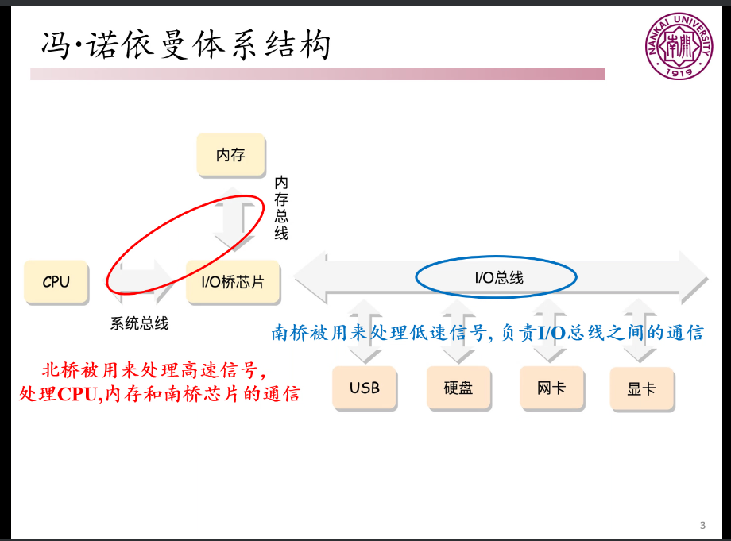
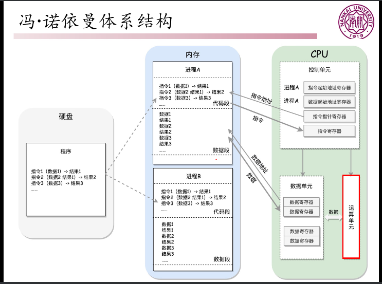
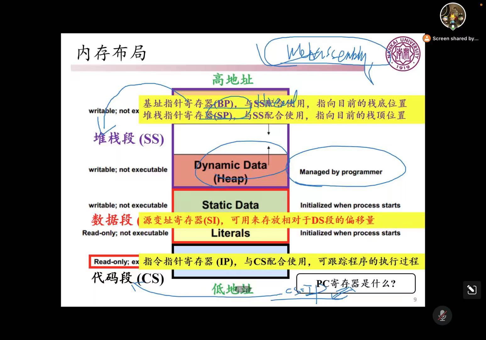
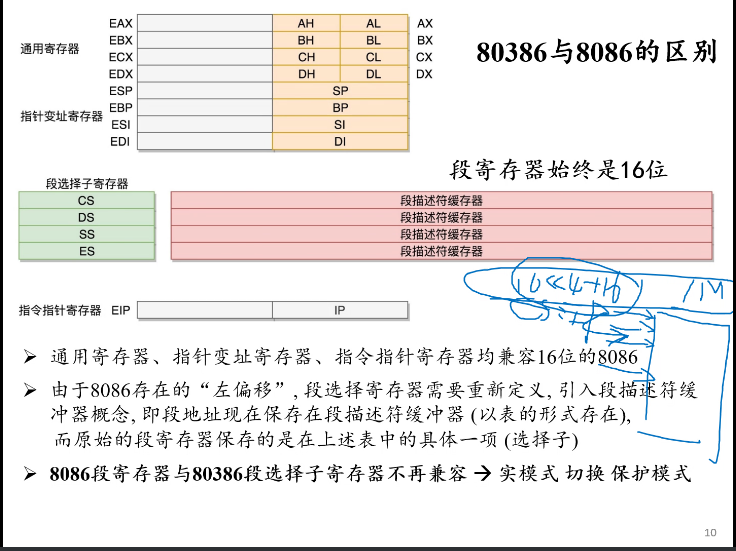

# OS

## 01 Introduction

important：
红黑树

1、南北桥

南桥：处理低速信号，I/O总线之间的通信
北桥：高速信号，处理高速信号，CPU，内存和南桥芯片的通信

2、冯氏结构特点：可编程、计算和存储分离

1)采用指令和数据存储在一起的结构
2)存储器是按地址访问、线性编址的空间
3）指令有操作码和地址码组成
4）指令在CPU的运算单元处理
5）控制流由指令流产生

3、冯诺一曼瓶颈？
1)在网卡内直接计算
but 网卡内空间小 只能进行简单运算
2)存内计算
即将CPU置于内存之内，降低传输代价
3)DMA与R(remote 增加网络)DMA

4、计算机指令例子
1)rbp和rsp用于栈的操作（pop&push）
2)sp是栈顶

5、
    const char str[] = "abcd";        //abc存储在堆栈中
    const char *str = "abcd";         //abc存储在静态存储区，str在栈里面，但后面的字符串在常量区

具体见<https://blog.csdn.net/hackbuteer1/article/details/6706562>

6、内存分段的原因？1M内存最大可以分几段？
(1)内存分段机制是为了区别代码和数据，代码和代码放一起，数据和数据放一起。
(2)一个段0~64K，1024/64=16段，（段不宜再细分？虚拟页？）

7、内存布局

8、80386和8086的区别

最大区别：段选择子寄存器
物理含义发生变化，不在兼容→实模式 切换 保护模式

▲
回顾：
冯诺依曼体系结构
8086和80836
计算机指令、内存布局、函数调用
仍未解决：
实模式切换保护模式
程序分段、分页的管理
内存程序何时使用CPU

9、什么是操作系统？
