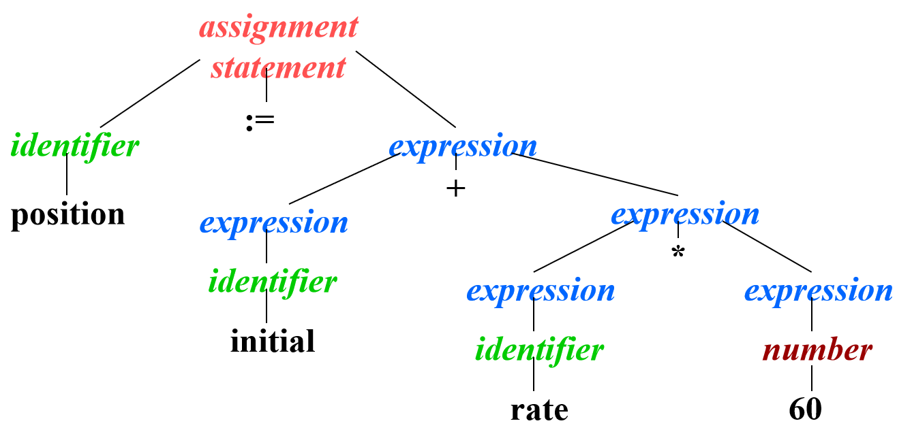
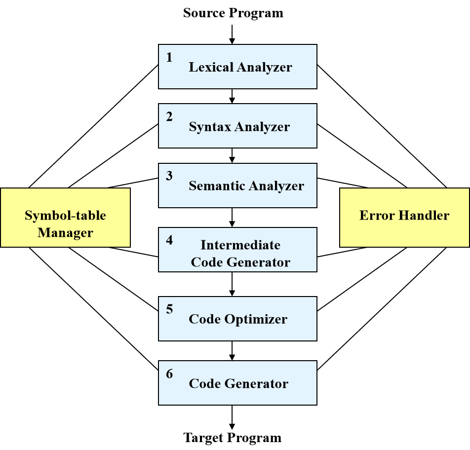

# Principles Of Compilers

课程内容：

1、理解源程序的理论和技术：词法分析、语法分析、语义分析

2、将理解的结果转化为等价的目标程序的理论和技术：中间代码生成、目标代码生成

3、关于做得更好的理论和技术：一些基本的优化方法
源程序→目标程序 （目标代码生成）

## 第一章 编译器简介

编译器都做点什么？

词法分析→分词token
↓
语法分析→语法树
↓
语义分析→类型检查&转换：运算对象是否符合运算符对其要求？——特定类型
↓
中间代码生成→虚拟机程序
↓
代码优化——机器无关的：如，临时变量与寄存器的使用
↓
目标代码生成——汇编码

### 1.1编译器

#### 1.1.1分析——综合模型

两个基本组成部分
分析：将源程序分解为基本组成部分，生成中间表示形式
综合：从中间表示形式构建目标程序

中间表示形式——树
节点——操作，孩子——参数

静态检查splint

赋值语句:=

### 1.2源程序分析

三个阶段
1、线性分析/词法分析
由左至右扫描源程序字符序列→token，单词（记号）——具有组合意义的字符序列
2、层次分析/语法分析
单词序列→有意义的集合，语法单位
3、语义分析
检查程序各部分是否正确符合语义

#### 1.2.1  词法分析

线性分析，词法分析，扫描
忽略空格、回车等，将字符组合为单词
把单词分为一个一个的token

#### 1.2.2  语法分析

层次分析，分析（parsing），语法分析
将词法分析产生的单词组合为语法短语


(简化的语法分析树)仅保存单词
内部结点——运算符，叶结点——运算对象


语法结构的递归定义⭐
语句定义(stmt)
文法（处理token相互关系和结构的一组规则）

▲区别词法分析和语法分析：是否需要递归

#### 1.2.3  语义分析

1、确定语法结构无歧义的唯一的含义

2、检查不合语义的错误

3、为代码生成收集信息

4、最重要的工作：类型检查，2 + ‘a’

### 1.3 编译器的多个阶段



#### 1.3.1符号表创建/管理

每个记录：一个标识符及其属性
<标识符，属性>

#### 1.3.2错误检测和报告

词法分析：字符无法构成合法单词

语法分析：单词流违反语法结构规则

语义分析：语法结构正确，但无实际意义

#### 1.3.3分析阶段

词法分析

语法分析→语法分析树

#### 1.3.4中间代码生成

虚拟机程序——不依赖实际体系结构

应有两个重要特性：容易生成；容易翻译为目标程序；

三地址码类似于汇编语言的指令序列组成，每个指令最多有三个操作数 (operand)，并且通常是赋值和二元运算符的组合；

#### 1.3.5代码优化

生成运行速度更快的机器码

简单直接的优化：

temp1 := id3 * 60.0

id1 := id2 + temp1

“优化编译器”

存在简单但非常有效的优化方法——不会大幅减慢编译速度

#### 1.3.6代码生成

生成可重定位机器码或汇编码

确定变量的内存位置

中间代码指令→机器指令

关键：为变量指定寄存器

### 1.4语言处理系统

#### 1.4.1预处理器

1、宏的处理
定义宏：名、体、形参

#define ：C、C++方式

编译之前用宏体文本代替宏调用（实参代替形参）

2、包含（头）文件

3、“Rational”预处理器

为旧的编程语义增加较新的流程控制、数据结构等功能

利用宏定义while, if等

使C类似Pascal

#define   begin   {

#define   end       }

#define   then

4、语言拓展

(1)Equel：嵌入C的数据库查询语言

Retrieve (DN=Department.Dnum) where

Department.Dname = ‘Research’

转换为对数据库查询函数的调用

(2)较早的C++预处理器

#### 1.4.2汇编器

编译器生成汇编代码→由汇编器生成可重定位机器码

汇编代码——机器码的助记码→名字替代二进制操作码、内存地址

#### 1.4.3  两次扫描汇编

每次读取一遍输入文件

(1)第一次

识别标识符，存入符号表

指定（相对）内存地址

标识符          地址

a 0

b 4

(2)第二次

指令→二进制序列，标识符→内存地址

产生可重定位机器码

0001 01 00 00000000 *

0011 01 10 00000010

0010 01 00 00000100 *

#### 1.4.4  加载器和连接器

加载器：修改可重定位机器码中地址（加上加载地址），装载到指定内存位置，若加载内存地址L=00001111

连接器：将多个可重定位机器码文件组合为单一程序

#### 1.4.5 编译器各阶段的组合

1、前端和后端

2、扫描

3、减少扫描次数

#### 1.4.6 编译器开发工具

## 第二章

本章内容：
构造一个以语法分析器为核心的编译器——将中缀表达式转换为后缀表示形式
利用上下文无关文法描述源语言的语法结构

利用语法制导翻译方法进行表达式转换

构造预测分析器，进行语法分析，并同时进行语法制导翻译

构造更复杂的词法分析器——消除单字符单词的限制，支持变量
符号表的简单实现方法

### 2.1概述

*上下文无关文法*
四个部分组成：
1、一组终结符号，单词，基本符号（原句中出现过的）
2、一组非终结符号（语法变量），语法范畴，语法概念，（是抽象的，且原句中没有出现过的）
3、一组产生式，定义语法范畴

```python
A→α   
```

A——一个非终结符，左部
α——终结符或/与非终结符串，右部
4、一个特定的非终结符——开始符号，start symbol（如：程序是开始符号？）

*形式化定义*
(1)Σ：有穷字母表，元素——符号
(2)符号串：Σ中符号构成的有穷序列
(3)空字：不含任何符号的序列，ε=[],相当于空元素
(4)Σ*：符号串全体，包括空字
(5)φ：空集{}，表示空集合，区分ε=[]，{}=φ，{ε}={[]}
(6)Σ*的子集U、V的积（连接）
UV={αβ|α∈U且β∈V}
(7)UV≠VU，(UV)W=U(VW)
(8)V自身的n次积（连接）记为Vn
(9)V0={ε}
(10)V的闭包（closure）
V=V0UV1UV2……UVn
每个符号串，都是V中符号串有限次连接
(11)正则闭包，V+=VV*

### 2.2推导

2.2.1语法分析树
·单词串(string)：0个或多个单词构成的序列
·推导(derive)：
(1)由开始符号作为推导起点
(2)用产生式右部替换左部非终结符
(3)反复替换，最终得到单词串
·语言(language)：语法所定义的语言——可由开始符号推导出的所有单词串的集合

使用最右推导或最左推导

2.2.2二义性

2.2.3运算符的结合律
左结合（left associative）：+，-，+，/
右结合（r s）：^，=

结合优先级的表达式文法：
expr →  expr + term | expr – term | term
*term* →  term * factor | term / factor | factor
*factor* →  digit | (  expr  )
digit →  0 | 1 | 2 | 3 | … | 9
expr、term、factor——不同的优先级

pic1例子

pic2例子

### 2.3语法制导翻译

语义制导翻译=语义分析+中间代码生成

#### 2.3.1 中缀改后缀

表达式E的后缀形式Postfix(E)如何生成：
E为变量或常量：Postfix(E) = E
E = E1 op E2，op—二元运算符，E1、E2—子表达式：
Postfix(E) = Postfix(E1 op E2)= Postfix(E1) Postfix(E2) op
E = (E1)：Postfix(E) = Postfix(E1)

#### 2.3.2 语法制导定义

基于语言的上下文无关文法
语法符号（非关联符和关联符）——一组属性
产生式——一组语义规则(semantic rule)——属性值计算规则
CFG+语义规则→语法制导定义

语法制导翻译的基本过程

#### 2.3.3 综合属性

synthesized attributes：节点属性值由其孩子节点属性值所决定
自底向上（bottom-up）计算
